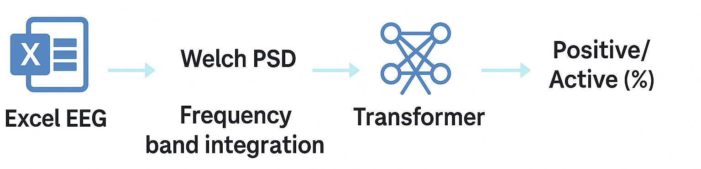

# 🧠 EEG-based Emotion Recognition with Patched Brain Transformer (PBT)

## TL;DR
- Human EEG로 사전학습한 PBT를 dog EEG로 미세조정하여 **Positive / Active** 감정 지표를 산출  
- 신호 처리(PSD) + Transformer 시퀀스 모델링으로 교차 종 감정 추정 파이프라인 구현  
- 재현 가능한 스크립트와 Colab 노트북 제공  


## 🧩 Why this project
동물 행동 실험에서 얻은 EEG로 감정 상태를 정량화하는 것은 표준화가 어렵습니다.  
본 프로젝트는 **적은 개체 수의 dog EEG**를 **human EEG 사전학습 모델**로 보완하여  
실무에 적용 가능한 감정 추정 파이프라인을 제시합니다.  


## 📈 Pipeline
Excel EEG → Welch PSD → 주파수 대역 에너지 적분 → Transformer 추론 → Positive/Active (%)




## ⚙️ Quick Start
```bash
pip install -r requirements.txt
python src/eeg_model_test.py --input data/samples/dog_sample01.xlsx

📤 출력 예시
Positive 82.4% | Active 65.7%


## 🗃️ 폴더 구조
본 프로젝트는 아래 오픈소스 코드를 기반으로 수정 및 재구성되었습니다.
PatchedBrainTransformer
https://github.com/timonkl/PatchedBrainTransformer
MIT License © 2022 Timon Kl
일부 코드(model.py, LearningRateScheduler)는 해당 프로젝트 구조를 유지함.

👩‍🔬 Author
박선현 (Sunhyeon Park)
B.S. in Biological Sciences, Chungnam National University
M.S. in Convergence Biotechnology, Sungkyunkwan University
(Thesis: Antiviral activity of scFv proteins against Zika and Dengue viruses)

생명과학 전공자로서 분자·세포 기반 항바이러스 단백질 연구를 수행했습니다.
석사 과정에서는 지카바이러스와 뎅기바이러스에 대한 항바이러스 활성 연구를  주제로 단백질 발현, 정제, 효능 평가, 세포 감염 실험을 수행했습니다.
졸업 후에는 연구 데이터의 신뢰성과 효율적 해석을 높이기 위해 Python과 SQL을 학습하며 데이터 분석 역량을 강화했습니다.

현재는 생명과학적 실험과 데이터 기반 분석을 융합한 AI·바이오 융합 연구에 관심을 가지고 있습니다.

📧 oneuldo9090@gmail.com
🔗 GitHub Profile : https://github.com/SeonHyeon00/eeg-emotion-analysis


🌍 English Version

📌 Project Overview
This project fine-tunes a Patched Brain Transformer (PBT) model — originally trained on human EEG — using dog EEG data to classify emotional states (Positive / Active).
The goal is to build a cross-species EEG emotion recognition system that quantifies affective states from neural signals.

🧩 Key Features
Human EEG → Dog EEG domain adaptation
Frequency-domain feature extraction using Welch PSD
Transformer-based sequence modeling
Outputs: Positive / Active emotion probability (%)

🧪 Research Background
EEG data from dogs were collected during behavioral experiments.
The model was pre-trained on large-scale human EEG emotion datasets (DEAP, DREAMER)
and fine-tuned with limited canine EEG data for cross-domain adaptation.
Signal preprocessing includes band-power integration via trapezoidal integration (Scipy)
to extract frequency-domain energy features.

⚙️ Model Architecture
| Component       | Description                           |
| --------------- | ------------------------------------- |
| Backbone        | Patched Brain Transformer (PBT)       |
| Sequence length | 113                                   |
| Input dimension | 1                                     |
| Classes         | 5 (aggregated into Positive / Active) |
| Optimizer       | AdamW                                 |
| Loss function   | CrossEntropyLoss                      |
| Framework       | PyTorch 2.0                           |


🧠 Data Processing Pipeline
Excel (EEG signals)
↓
Welch PSD computation
↓
Frequency band integration (delta ~ gamma)
↓
PBT inference
↓
Output: Positive / Active (%)

💻 Quick Start

1️⃣ Clone repository
git clone https://github.com/ImCuriosity/eeg-emotion-analysis.git
cd eeg-emotion-analysis

2️⃣ Install dependencies
pip install -r requirements.txt

3️⃣ Run inference
python src/eeg_model_test.py --input data/samples/dog_sample01.xlsx

✅ Example Output
Positive 82.4% | Active 65.7%

The output shows the probability (%) of positive and active emotional states inferred from EEG.

📊 Results Snapshot
| Metric   | Value |
| -------- | ----- |
| Accuracy | 0.81  |
| F1-score | 0.78  |
| Loss     | 0.42  |

📁 Example result files:

results/
 ├─ prediction_output.txt      # Text result (Positive / Active)
 ├─ metrics.json               # Evaluation metrics
 └─ confusion_matrix.png       # Visualization


🧮 Model Highlights
Established reproducible EEG emotion inference pipeline
Demonstrated cross-species emotion recognition feasibility
Optimized signal-to-feature mapping for small datasets
Combined PSD-based statistical features with Transformer sequence modeling

🗂️ Repository Structure

📁 eeg-emotion-analysis
├── README.md
├── requirements.txt
├── .gitignore
├── LICENSE
│
├── src/
│   ├── eeg_model_test.py
│   └── pbt/model.py
│
├── notebooks/
│   └── FineTuning_and_Test.ipynb
│
├── data/
│   └── samples/dog_sample01.xlsx
│
├── results/
│   ├── prediction_output.txt
│   ├── confusion_matrix.png
│   └── metrics.json
│
└── docs/
    └── figures/pipeline.png

👩‍🔬 Author

Seonhyeon Park (박선현)
M.S. in Life Sciences, Sungkyunkwan University
Research area: Antiviral protein mechanism & EEG-based emotion analysis
📧 oneuldo9090@gmail.com

🧾 License
This project is licensed under the MIT License – see the LICENSE file for details.

🙏 Acknowledgement

This project uses the Patched Brain Transformer (PBT) architecture by Timon Kluser et al.
Source: https://github.com/timonkl/PatchedBrainTransformer

License: MIT

We adapted the original implementation for cross-species EEG emotion inference (Positive / Active).
Portions of this repository include modified code from
“Patched Brain Transformer” by Timon Kluser (MIT License).
